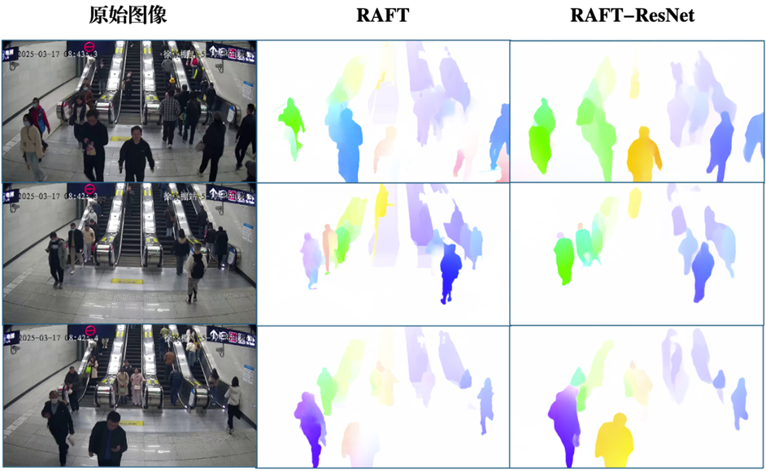
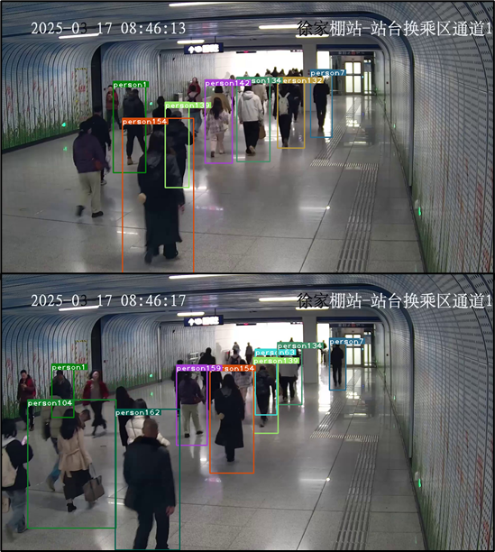

## 密集人群运动分析

组长：晏瑞阳

组员：蔡烨南 王佳豪 王亦飞 丁心成

### 进度简述：

1. 已完成五篇论文的综述终稿，详情可见`论文综述`（RAFT，DeepSORT，SHENet，SocialVAE，CPEPF）；
2. 已完成RAFT、Deep_sort、SocialVAE三种方法的复现；
3. 已完成集成可视化Demo的制作（目前已有RAFT、DeepSORT、SocialVAE三种方法）；
4. 已完成对WuhanMetro数据集的标注（平均120帧左右，Darklabel画框）；已采集100个视频（平均10帧左右）并部分标注；共计标注1500帧以上；二者均已上传至百度网盘，[数据集](https://pan.baidu.com/s/1qEcurJVToYpBjYmeZTJv0w?pwd=gqny)，内含WuhanMetro、自制数据集、数据集标注指南；
5. 完成了对Raft的改进与效果评估，具体改进方法见后面的章节；代码和日志文件已上传（包括log文本以及tensorboard日志）；
6. 完整项目报告的撰写；
7. 完成答辩PPT的制作；
8. 完成Raft-ResNet的代码注释工作，其他模型仅提供集成DEMO代码（Demo里会包括各模型核心代码文件）。

### 可视化demo视频

<video controls src="pictures/merged_output.mp4" title="Title"></video>

### 改进模型：RAFT-ResNet


### RAFT改进方法

在进行RAFT测试的过程中，发现光流法有一个很大的通病，就是只能机械地响应运动的物体。当任务场景为扶手电梯上的人、或是头部相对身体位移不明显时，光流预测结果往往会出现“电梯光流”或“无头”的情况，如下图。经过分析，我认为这是由于RAFT模型缺乏对语义信息的捕捉能力，于是我将GRU网络初始输入端的简单卷积网络替换为了经过裁剪和调整的ResNet101残差卷积神经网络，利用迁移学习的知识将ResNet在ImageNet上训练所得的语义捕捉能力迁移到RAFT中，目前已经有了不错的效果（EPE端点损失从1.26降为0.98）。但是由于光流数据集样本标签（即光流标签文件）本身就受限于这种机械响应的通病，因此在有缺陷的数据集上训练出来的模型并不一定能彻底解决上述问题。


改进前后效果对比如下：



### 部分实验结果

#### RAFT
<!-- 
 -->


#### SocialVAE
<!--  -->


#### DeepSORT



### 代码仓库介绍

```python
├── Dataset
│   ├── Dataset.py      数据加载类
│   └── _init_.py
├── README.md
├── core
│   ├── _init_.py
│   ├── dataloader.py   数据加载管理
│   ├── loss.py         loss函数管理
│   ├── model.py        模型管理
│   ├── optimizer.py
│   └── utils.py        常用工具
├── evaluate.py
├── main.py             可运行主函数
├── models
│   └── crowdflow.py
├── opts.py             参数管理
├── result
│   ├── checkpoints
│   ├── logs
│   ├── models
│   └── tensorboard     tensorboard可视化结果
├── tools               工具
│   └── check.py        
├── train.py
├── demo
│   ├── checkpoint
│   ├── model
│   ├── DeepSORT_demo.py
│   ├── RAFT_demo.py
│   ├── SocialVAE_demo.py
│   ├── demo.py
│   └── demo.sh
```
