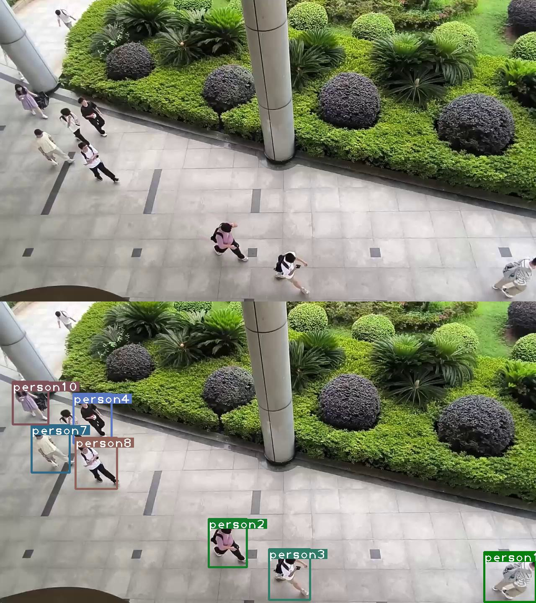

## 密集人群运动分析

组长：晏瑞阳

组员：蔡烨南 王佳豪 王亦飞 丁心成

### 小组进度（截止至6.15）
详细进度可在`每周汇总`文件夹中查看  
进度简述：
1. 已完成五篇论文的综述终稿，详情可见`论文综述`（RAFT，Deep_sort，SHENet，SocialVAE，CPEPF）；
2. 已完成RAFT、Deep_sort、SocialVAE三种方法的复现；
3. 已完成集成可视化Demo的制作（目前已有RAFT、Deep_sort两种方法，SocialVAE基于文本形式坐标点运行，只能简单的可视化）；
4. 已完成对WuhanMetro数据集的标注（平均120帧左右）Darklabel画框）；已采集100个视频（平均10帧左右）并部分标注；共计标注1500帧以上；
5. 正在研究如何改进RAFT光流法；
6. 正在进行SHENet的复现，但环境配置较为特殊；
7. 项目报告已完成绪论、相关工作、数据集介绍（包括WuhanMetro和自制数据集）部分的撰写；
8. PPT已完成框架、页面、动画设计，但需要根据答辩限制时间调整内容量。

### 部分实验结果
#### RAFT


#### SocialVAE


#### DeepSORT



### 代码仓库介绍
```
├── Dataset
│   ├── Dataset.py      数据加载类
│   └── _init_.py
├── README.md
├── core
│   ├── _init_.py
│   ├── dataloader.py   数据加载管理
│   ├── loss.py         loss函数管理
│   ├── model.py        模型管理
│   ├── optimizer.py
│   └── utils.py        常用工具
├── evaluate.py
├── main.py             可运行主函数
├── models
│   └── crowdflow.py
├── opts.py             参数管理
├── result
│   ├── checkpoints
│   ├── logs
│   ├── models
│   └── tensorboard     tensorboard可视化结果
├── tools               工具
│   └── check.py        
└── train.py
```

