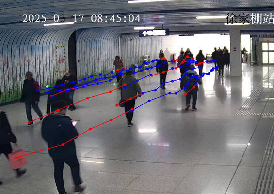

## 密集人群运动分析

组长：晏瑞阳

组员：蔡烨南 王佳豪 王亦飞 丁心成

### 项目成果：

1. 已完成五篇论文的综述终稿，详情可见`论文综述`（RAFT，DeepSORT，SHENet，SocialVAE，CPEPF）；
2. 已完成RAFT、Deep_sort、SocialVAE三种方法的复现；
3. 已完成集成可视化Demo的制作（包括RAFT、DeepSORT、SocialVAE三种方法）；
4. 已完成对WuhanMetro数据集的标注（平均120帧左右，Darklabel画框）；已采集100个视频（平均10帧左右）并部分标注；共计标注1500帧以上；二者均已上传至百度网盘，[数据集](https://pan.baidu.com/s/1qEcurJVToYpBjYmeZTJv0w?pwd=gqny)，内含WuhanMetro、自制数据集、数据集标注指南；
5. 完成了对Raft的改进与效果评估，具体改进方法见后面的章节；代码和日志文件已上传（包括log文本以及tensorboard日志）；
6. 完成项目报告的撰写；
7. 完成答辩PPT的制作；
8. 完成Raft-ResNet的代码注释工作，其他模型仅提供集成DEMO代码（Demo里会包括各模型核心代码文件）。

### 可视化demo视频

<video controls src="pictures/merged_output.mp4" title="Title"></video>
见 pictures 中视频。

### 改进模型：RAFT-ResNet

改进前后效果对比如下：

### 部分实验结果

#### RAFT

#### SocialVAE

#### DeepSORT

